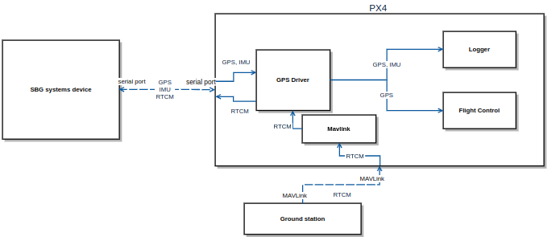

# Support for SBG systems device
PX4 Firmware doesn't support external INS devices. In order to support SBG systems devices a new GPS driver has been developed by SBG systems within the PX4 Firmware in order to communicate with a SBG systems device and use it as an external GPS device. This driver provides GPS data to the Flight Control, it can be used to transmit RTCM data to the SBG systems device in order to enable RTK and to log IMU and GPS data from the SBG systems device for post-processing with Qinertia.



## What change in PX4 firmware ?
A pull request has been sent to the official PX4 Firmware repository to add the SBG systems GPS device driver to the GPS driver of PX4 firmware. For now  the fork that contains this project is available at [SBG-Systems/PX4_Firmware.git](https://github.com/SBG-Systems/Firmware.git).

- The SBG systems GPS device driver is based on the SBG communication protocol, which is sbgECom so the sbgECom library has been added to the PX4 Firmware as a library. ([commit/7093cd6193caf4a9e77837fd01f432069bd45e91](https://github.com/SBG-Systems/PX4_Firmware/commit/7093cd6193caf4a9e77837fd01f432069bd45e91)
- SBG devices send lots of data that could not been handle initially by the GPS driver sothe GPS driver has been modify to handle a serial connexion with a baud rate of 460800 or 921600 bauds. ([commit/11f3a2d561610cc69ca6a50e3d484b78b3420c87](https://github.com/SBG-Systems/PX4_Firmware/commit/11f3a2d561610cc69ca6a50e3d484b78b3420c87))
- To avoid data loss, fmu-v5 board configuration has been changed to use DMA. The user should configure his board in order to avoid this problem on the port used to communicate with the SBG systems device. ([commit/09389ee98ae9416cfccd88c6edd22edccb3724aa](https://github.com/SBG-Systems/PX4_Firmware/commit/09389ee98ae9416cfccd88c6edd22edccb3724aa))
- The uorb topic Gps_dump has been added to the logged topics list. It is possible to extract incoming data from the SBG systems device with [pyulog](https://pypi.org/project/pyulog/) and post-process these data with Qinertia. ([commit/29322e8240e0196e29588a1c9f1b3d7aafecee72](https://github.com/SBG-Systems/PX4_Firmware/commit/29322e8240e0196e29588a1c9f1b3d7aafecee72))

### Note:
Some parameters of the sensor_gps topic published by the GPS driver are not provided by the SBG systems device and have been set to 0:

- hdop

- vdop

- noise_per_ms

- jamming_indicator

## PX4 Board configuration
The serial port of the PX4 board used to communicate with the SBG Systems device must support 460800 or 921600 bauds to avoid data loss.

If this requirement is not met, the DMA controller can be configured to reduce the number of CPU interrupts and discharge transfers on DMA as suggest before.

For example the board Pixhawk fmu-v5 has been configured to meet this requirement.

## SBG systems device configuration
The SBG systems device configuration depends on the application because PX4 Firmware only uses GPS data for Flight Control, so if post-processing is not required IMU data and system status are not required.
### Flight control requirement:

- UTC @ 1 Hz
- GPS 1 Velocity @ On New Data
- GPS 1 Position @ On New Data
- GPS 1 True Heading @ On New Data

### Qinertia post-processing requirement:

- System Status @ 1 Hz

- UTC @ 1 Hz

- IMU Short @ On New Data

- GPS 1 Velocity @ On New Data

- GPS 1 Position @ On New Data

- GPS 1 True Heading @ On New Data

- GPS 1 Raw data @ On New Data

### Serial port configuration:
baud rate: 460800 or 921600 bauds.

RTCM can be assigned to the port used to communicate with the PX4 autopilot.
## RTK
RTCM data can be encapsulated in the MAVLink message [GPS_RTCM_DATA](https://mavlink.io/en/messages/common.html#GPS_RTCM_DATA) and sent to the PX4 autopilot. The autopilot will transmits the incoming RTCM data to the SBG systems device.  

## Work flow
This demonstration has been made with a Holybro pixhawk 4 mini (based on Pixhawk FMUv5).

The SBG systems device is an [ellipse-D](https://www.sbg-systems.com/products/ellipse-series/#ellipse-d_rtk_gnss_ins) and it has been configured for post-processing with Qinertia. The port A is connected to the PX4 autopilot with a baud rate of 921600 bauds and the RTCM has been assigned to the port A.
##" Compile the firmware
The firmware used for this example is [SBG-Systems/PX4_Firmware.git](https://github.com/SBG-Systems/PX4_Firmware.git). It has been compiled for a px4_fmu-v5_default board and uploaded on the pixahwk 4 mini.

If required follow this documentation to setting up a developer environment [dev.px4.io/master/en/setup/dev_env.html](https://dev.px4.io/master/en/setup/dev_env.html) and to upload the firmware [dev.px4.io/master/en/setup/building_px4.html#uploading-firmware-flashing-the-board](https://dev.px4.io/master/en/setup/building_px4.html#uploading-firmware-flashing-the-board).
### Restart the gps driver
The GPS driver should be restarted in order to set the baud rate at 921600 bauds and set the GPS port to /dev/ttyS0.
```bash
nsh> gps stop
```
```bash
nsh> gps start -b 921600 -d /dev/ttyS0 -p sbg
```

### Restart the logger
To avoid logging dropouts it is recommended to increase the logger buffer size (50Ko has been chosen arbitrary) . The logger can be configured to be triggered by gps_dump.
```bash
nsh> logger stop
```
```bash
nsh> logger start -e -f -p gps_dump -b 50
```

### RTCM
RTCM data has been sent to te PX4 autopilot with the GPS_RTCM_DATA message as explain before.
### Check GPS status
To check GPS state use:
```bash
nsh> gps status
```
```bash
nsh> listener estimator_status
```
### Post-process with Qinertia
After download the log file, it is necessary to extract the SBG binary data from the log file before post-process it with Qinertia. For that use the extract_gps_dump methods of the pyulog library ([PX4/pyulog](https://github.com/PX4/pyulog)).
```bash
ulog_extract_gps_dump <log_name>
```
ulog_extract_gps_dump function create two binary files, the file ending with "from_device.dat" contains raw data from the SBG systems device and can be drag and drop in Qinertia.
